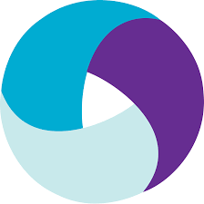
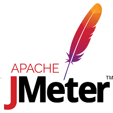
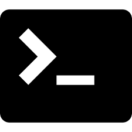

## Hi 👋, I'm a Software QA Engineer working in Dhaka, Bangladesh

#### Now

- ✨ Contributing to [FastPay](https://www.fast-pay.iq/);
- :fire: Interested in Automation testing for both web and mobile apps;
- :calendar: Looking for contributing to Java - Selenium and Appium based open source projects 

#### Bio

- 🏢 I'm currently working at **Newroz Technologies Limited**
- ⚙️ I use daily: `.py`, `.jmx`, `.myd`
- 🌍 I'm mostly active within the **SQA Community**
- 🌱 Learning all about **Automation**
- 💬 Ping me about **Selenium**, **Python**, **Postman**, **Jmeter**, **MySQL**, **Jira**
- 📝 Checkout my [Resume](files/Sajjad-Hossain-SQA-Resume.pdf)

#### My Current Stack

       

<!-- #### Development Stuffs:

<b>⚡ Github Stats</b>

 

#### Connect With Me

 

 -->
